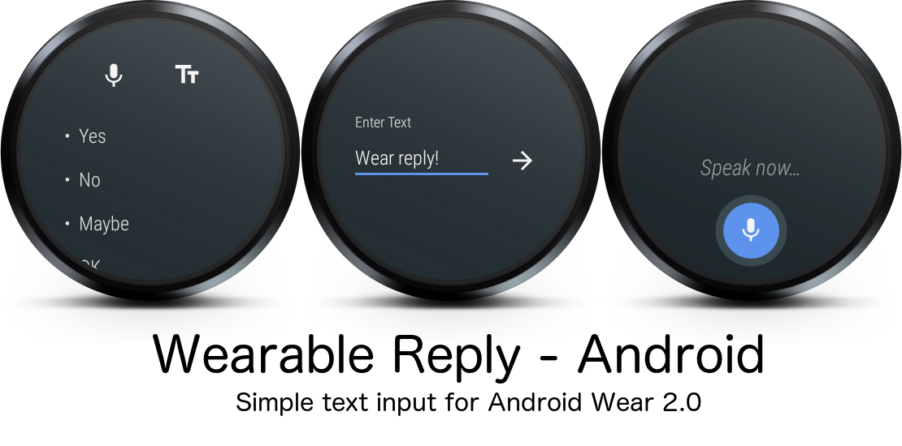

# Wearable Reply

While Google made a very nice wearable activity to reply to notifications, they didn't make a good `Intent` to compose text within apps running Android Wear 2.0. This library aims to simplify allowing text input in your app, via voice, keyboard, or canned responses. Google really should have provided something like this from the start, and not juse kept it for notifications.

## Including It In Your Project

To include it in your project, add this to your module's `build.gradle` file:

```groovy
dependencies {
	...
	compile 'com.klinkerapps:wearable-reply:1.0.0'
}
```

Usage is really simple. Start the reply activity with:

```java
reply.setOnClickListener(new View.OnClickListener() {
    @Override
    public void onClick(View v) {
        WearableReplyActivity.start(activity, new String[] {"test 1", "test 2" });
    }
});
```

You can omit the `String[]`, or use an array resource. If you omit it, the app will use the default canned responses: "Yes", "No", "Maybe", "Ok", and "Thanks".

Then, when the user is done entering the text, the results will be delivered to your `Activity#onActivityResult` method, and can be pulled with:

```java
@Override
protected void onActivityResult(int requestCode, int resultCode, Intent data) {
    super.onActivityResult(requestCode, resultCode, data);

    String result = WearableReplyActivity.getResultText(data);
    if (result != null) {
        Toast.makeText(this, result, Toast.LENGTH_SHORT).show();
    }
}
```

## License

    Copyright 2017 Luke Klinker

    Licensed under the Apache License, Version 2.0 (the "License");
    you may not use this file except in compliance with the License.
    You may obtain a copy of the License at

       http://www.apache.org/licenses/LICENSE-2.0

    Unless required by applicable law or agreed to in writing, software
    distributed under the License is distributed on an "AS IS" BASIS,
    WITHOUT WARRANTIES OR CONDITIONS OF ANY KIND, either express or implied.
    See the License for the specific language governing permissions and
    limitations under the License.
